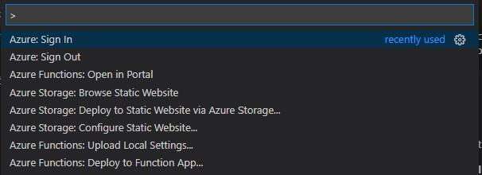

# Example web app using Azure Functions and SignalR

Inspired by https://docs.microsoft.com/en-gb/learn/modules/automatic-update-of-a-webapp-using-azure-functions-and-signalr/

## Pre-Requisites

- Node.js
- Visual Studio Code
- Azure Functions Core Tools (> 2.6.666)
- Azure Functions extension for Visual Studio Code
- Azure Storage extension for Visual Studio Code

## Azure Resources Set Up

Generate random resource names

```
export RG_ACCOUNT_NAME=rgsignalrfuncdemo$(openssl rand -hex 5)
export STORAGE_ACCOUNT_NAME=mslsigrstorage$(openssl rand -hex 5)
export SIGNALR_SERVICE_NAME=msl-sigr-signalr$(openssl rand -hex 5)

```
Create Storage Account

```
az storage account create \
  --name $STORAGE_ACCOUNT_NAME \
  --resource-group $RG_ACCOUNT_NAME \
  --kind StorageV2 \
  --sku Standard_LRS
```

Create Cosmos DB

```
az cosmosdb create  \
  --name msl-sigr-cosmos-$(openssl rand -hex 5) \
  --resource-group $RG_ACCOUNT_NAME
```

Get the connection strings for the resources to use in local.settings.json

```
STORAGE_CONNECTION_STRING=$(az storage account show-connection-string \
--name $(az storage account list \
  --resource-group $RG_ACCOUNT_NAME \
  --query [0].name -o tsv) \
--resource-group $RG_ACCOUNT_NAME \
--query "connectionString" -o tsv)

COSMOSDB_ACCOUNT_NAME=$(az cosmosdb list \
    --resource-group $RG_ACCOUNT_NAME \
    --query [0].name -o tsv)

COSMOSDB_CONNECTION_STRING=$(az cosmosdb list-connection-strings  \
  --name $COSMOSDB_ACCOUNT_NAME \
  --resource-group $RG_ACCOUNT_NAME \
  --query "connectionStrings[?description=='Primary SQL Connection String'].connectionString" -o tsv)

COSMOSDB_MASTER_KEY=$(az cosmosdb list-keys \
--name $COSMOSDB_ACCOUNT_NAME \
--resource-group $RG_ACCOUNT_NAME \
--query primaryMasterKey -o tsv)

SIGNALR_CONNECTION_STRING=$(az signalr key list \
  --name $(az signalr list \
    --resource-group $RG_ACCOUNT_NAME \
    --query [0].name -o tsv) \
  --resource-group $RG_ACCOUNT_NAME \
  --query primaryConnectionString -o tsv)

printf "\n\nReplace <STORAGE_CONNECTION_STRING> with:\n$STORAGE_CONNECTION_STRING\n\nReplace <COSMOSDB_CONNECTION_STRING> with:\n$COSMOSDB_CONNECTION_STRING\n\nReplace <COSMOSDB_MASTER_KEY> with:\n$COSMOSDB_MASTER_KEY\n\nReplace <SIGNALR_CONNECTION_STRING> with:\n$SIGNALR_CONNECTION_STRING\n\n""
```

Create SignalR service

```
az signalr create \
  --name $SIGNALR_SERVICE_NAME \
  --resource-group $RG_ACCOUNT_NAME \
  --sku Free_DS2 \
  --unit-count 1
```

Make SignalR service compatible with Azure Functions

```
az resource update \
  --resource-type Microsoft.SignalRService/SignalR \
  --name $SIGNALR_SERVICE_NAME \
  --resource-group $RG_ACCOUNT_NAME \
  --set properties.features[flag=ServiceMode].value=Serverless
```

## Info

### Function App

**getStocks** function - called once by the web client to load initial prices

**stocksChanged** function - has an input binding that gets changed from Cosmos DB, and an output binding that sends these to the SignalR service

**negotiate** function - provides the SignalR connection to the web client - the SignalR client SDK uses this endpoint by convention

### Web App

Files are all in public folder.

Uses `index.html.js` to use the Signal client SDK and Vue to keep the stock prices on screen updated via pushes from the SignalR server.

## Deployment

Can be deployed easily straight from Code - to a Function App (for backend) and to Storage static web hosting (for web client).

Using Command Palette and Azure extensions for Code:

